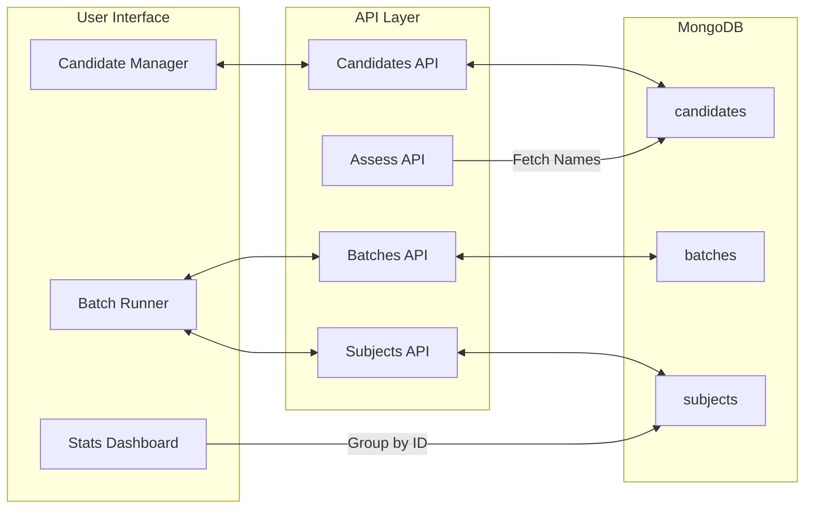

# Code Assessor: System Overview 🦅

Code Assessor is a specialized **Human-in-the-Loop Benchmarking Suite** designed to compare multiple code implementations (Candidates) through rigorous AI-driven architectural assessments. It prioritizes statistical significance and manual quality control over automated acceptance.

## 🏗️ Core Architecture & Hierarchy

The system is built on a hierarchical data model to support comparative benchmarking over time:

1.  **Project (Batch)**: A top-level container for a specific test suite (e.g., "Frontend Infrastructure 2025").
2.  **Task (Subject)**: The definition of a specific challenge. It contains:
    *   **Context**: The architectural requirements and constraints.
    *   **Candidates**: Multiple named code snippets (variable count, minimum 2).
    *   **Model Config**: Remembers the specific LLM Provider and Model assigned to this Task.
3.  **Trial**: A single execution instance of a Task. Trials are added or removed manually to reach the desired statistical significance.
4.  **Assessment (Output)**: The raw AI response consisting of a Markdown Report and extracted raw scores (e.g., "7/15").

## 🔄 The Benchmarking Workflow (The Loop)

The system follows a strict **Review -> Rerun -> Approve** lifecycle:

1.  **Preparation**: Tasks are defined with their Context and Candidate snippets. All changes (including model selection) are saved automatically via a debounced auto-save mechanism.
2.  **Execution**: The operator adds a **Trial** manually and triggers it. The system pulls the *current* state of the Task's snippets and context for the LLM call. The system makes two sequential LLM calls:
    *   **Call 1**: Generates a deep-dive architectural report with a Comparison Matrix.
    *   **Call 2**: Acts as a "Data Extraction Engine" to parse the matrix into raw score strings.
3.  **Manual Vetting (Needs Review)**: The AI's output is presented as a draft. 
    *   If the AI hallucinated or broke the table format, the operator hits **Rerun AI**.
    *   The operator can switch models between reruns to compare different "Senior Architects."
4.  **Finalization**: Clicking **Approve Result** locks the trial and marks it as `completed`. The system then automatically selects the next pending trial in the sequence to accelerate the review loop.

## 📂 Project Structure & Key Files

### Frontend Components (`/components`)
*   `Sidebar.tsx`: Global navigation and persistent history of projects (batches).
*   `SingleRun.tsx`: The "Playground" for quick, one-off tests (saves to a default project).
*   `BatchRunner.tsx`: The primary benchmarking workspace. Features a three-column layout (Tasks, Trials, Workspace) and an auto-saving Input Review panel for refining benchmarks.
*   `StatsDashboard.tsx`: The aggregator. It performs all the mathematical normalization (scaling raw strings like "4/15" to 10) and renders the candidate leaderboards.

### Backend Logic (`/app/api`)
*   `assess/route.ts`: The "brain." Contains the system prompts and the parsing logic that separates Markdown reports from JSON data blocks.
*   `subjects/` & `trials/`: CRUD operations for the persistent benchmarking hierarchy.
*   `providers/`: Dynamically fetches configured LLM models from the environment.

### Configuration & Persistence
*   `types/index.ts`: The Source of Truth for the data model (`Subject`, `Trial`, `AssessmentResult`).
*   `lib/mongodb.ts`: Database connection management.
*   `config/models.ts`: Registry of all supported LLM providers and their flagship models.

## 📊 Statistics Logic
The system deliberately defers all mathematical operations to the frontend. Raw AI data (like "7/15") is stored exactly as returned to maintain integrity. The `StatsDashboard` handles:
*   **Normalization**: Converting varied scales into a uniform 0-10 score.
*   **Aggregation**: Grouping scores by Candidate Name across all Approved Trials in the database.
*   **Consistency Tracking**: Showing how many trials back a specific candidate's score.

