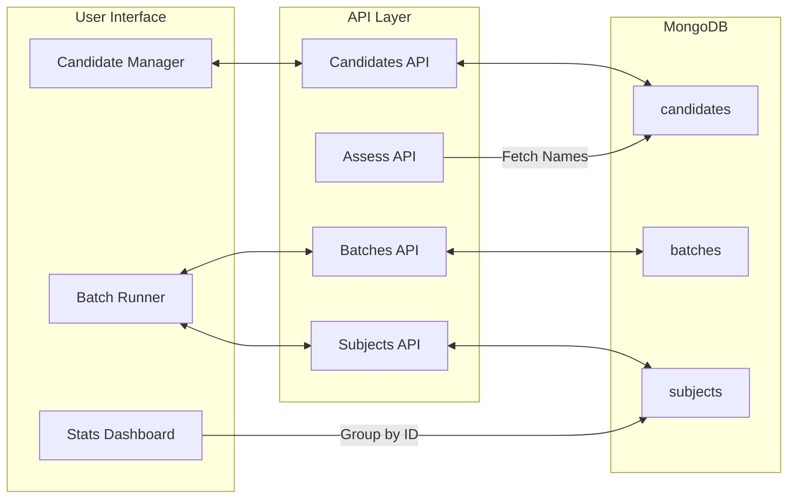

# Code Assessor: System Overview 🦅

Code Assessor is a specialized **Human-in-the-Loop Benchmarking Suite** designed to compare multiple code implementations (Candidates) through rigorous AI-driven architectural assessments. It prioritizes statistical significance and manual quality control over automated acceptance.

## 🏗️ Core Architecture & Hierarchy

The system is built on a hierarchical data model to support comparative benchmarking over time:

1.  **Candidate (Global)**: The primary identity of an implementation (e.g., "Senior Dev A", "Claude 3.5"). Candidates are stored in a global registry and reused across batches to maintain longitudinal data.
2.  **Project (Batch)**: A top-level container for a specific test suite (e.g., "Frontend Infrastructure 2025"). A Batch **subscribes** to a lineup of global candidates.
3.  **Task (Subject)**: The definition of a specific challenge. It contains:
    *   **Context**: The architectural requirements and constraints.
    *   **Snippets**: Implementation code for each candidate in the batch lineup, linked via `candidateId`.
4.  **Trial**: A single execution instance of a Task. Each trial is assigned a specific **LLM Provider and Model**, allowing for multi-judge assessments of the same task.
5.  **Assessment (Output)**: The raw AI response consisting of a Markdown Report and an extracted ranking (e.g., "1, 2, 3"). Rankings are stored exactly as returned by the model.

## 🔄 The Benchmarking Workflow (The Loop)

The system follows a strict **Review -> Rerun -> Approve** lifecycle:

1.  **Registry Management**: Operators define global candidates in the registry.
2.  **Preparation**: A project is created, and candidates are selected for the "Lineup." Tasks are then defined with their Context. Snippet editors are automatically generated for every candidate in the lineup.
3.  **Execution**: The operator adds a **Trial**, selects a **Model**, and triggers it. The system:
    *   Resolves `candidateId` to the current `name` for the prompt.
    *   Makes a **single LLM call** for both the architectural report and a structured ranking block (`<SCORES>`).
    *   Maps the returned ranks from names back to `candidateId` for stable storage.
4.  **Manual Vetting (Needs Review)**: The AI's output is presented as a draft. If the AI hallucinated or broke format, the operator hits **Rerun AI**.
5.  **Finalization**: Clicking **Approve Result** locks the trial and marks it as `completed`, allowing it to hit the statistics engine.

## 📂 Project Structure & Key Files

### Frontend Components (`/components`)
*   `Sidebar.tsx`: Global navigation including the **Candidate Registry** and Project History.
*   `CandidateRegistry.tsx`: UI for managing the global pool of assessed entities.
*   `BatchRunner.tsx`: The primary benchmarking workspace. Features a three-column layout (Tasks, Trials, Workspace) and a **Manage Lineup** panel for subscribing to candidates.
*   `StatsDashboard.tsx`: The aggregator. Normalizes raw strings (e.g., "4/15" to 10) and aggregates by `candidateId`.

### Backend Logic (`/app/api`)
*   `assess/route.ts`: The "brain." Handles ID-to-Name resolution for prompts and Name-to-ID mapping for results.
*   `candidates/`, `subjects/`, `trials/`: CRUD operations for the persistent hierarchy.

### Configuration & Persistence
*   `types/index.ts`: The Source of Truth for the data model (`Candidate`, `Subject`, `Trial`, `Batch`).
*   `lib/mongodb.ts`: Database connection management.

## 📊 Statistics Logic
The system deliberately defers mathematical operations to the frontend. Raw AI rankings (1..n) are stored exactly as returned. The `StatsDashboard` handles:
*   **Normalized Borda Count**: Converting raw ranks into a uniform 0-10 relative superiority score. 
    *   *Formula*: $\frac{n - \text{Rank}}{n - 1} \times 10$
*   **Aggregation**: Grouping these Borda points by `candidateId` across all projects and tasks.
*   **Consistency Tracking**: Using standard deviation of Borda scores to show performance stability.

